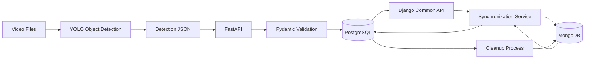
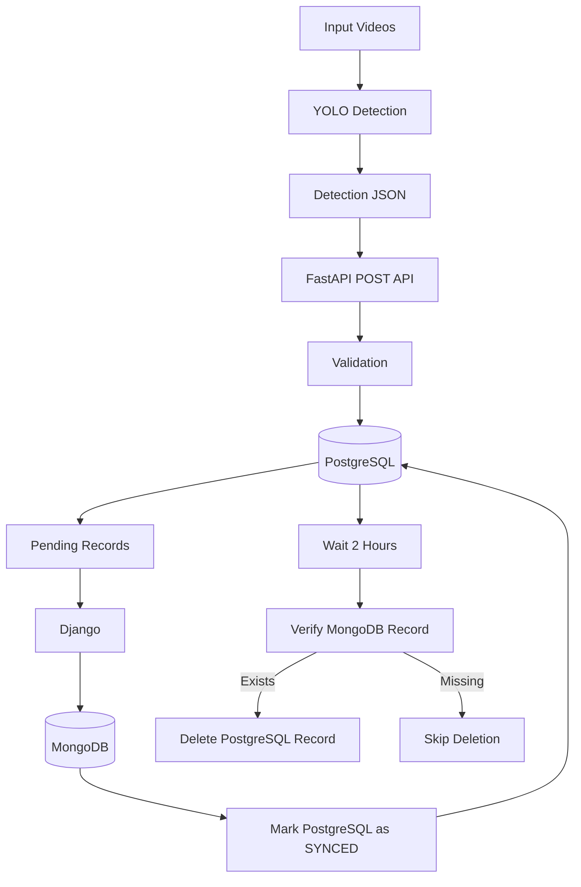
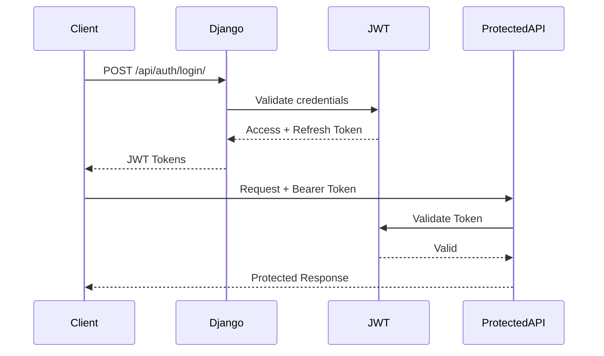
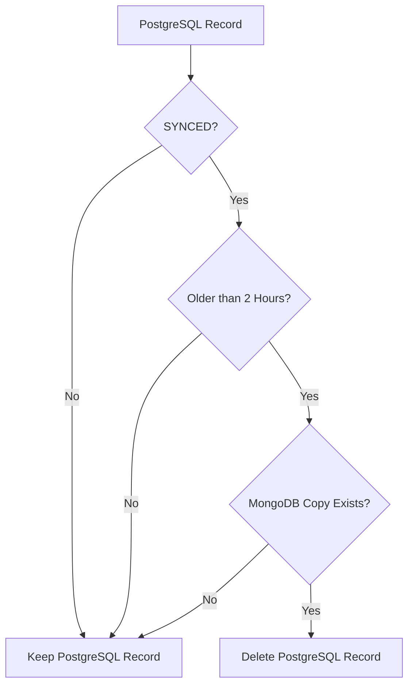
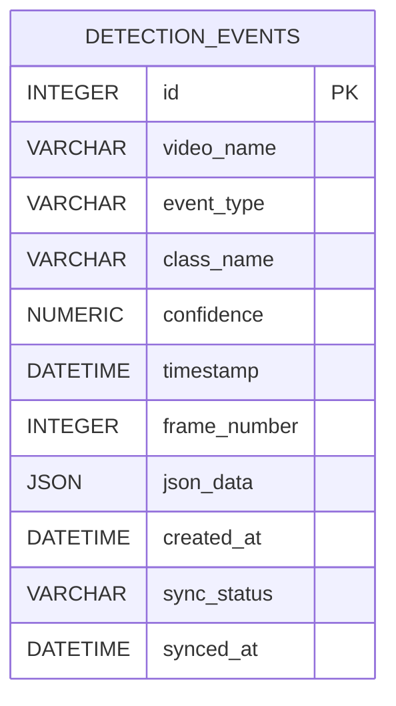
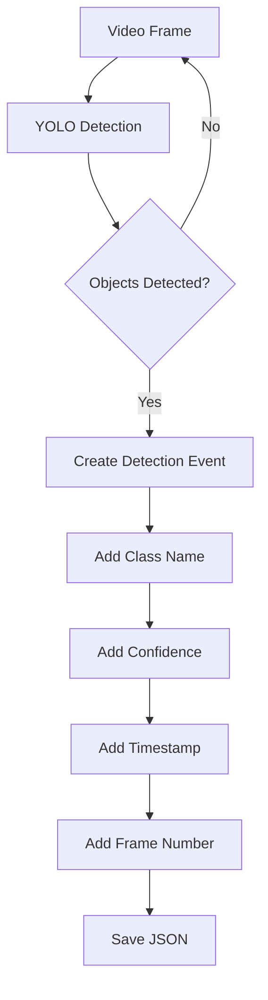
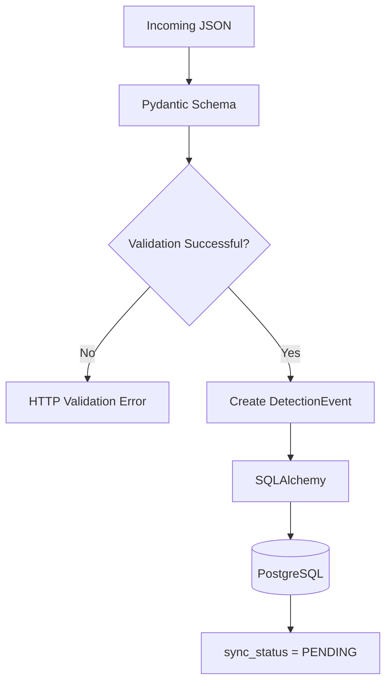
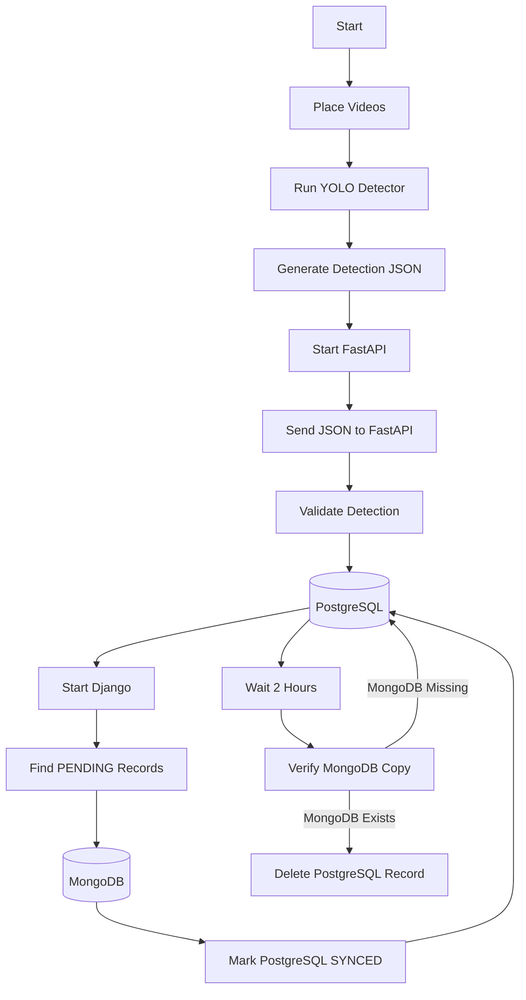

````markdown
# 🚀 DeepStream / YOLO FastAPI + PostgreSQL + Django + MongoDB Synchronization Pipeline


An end-to-end AI video detection and database synchronization pipeline that processes video files using YOLO object detection, sends structured detection data to a FastAPI backend, stores the data in PostgreSQL, synchronizes PostgreSQL records to MongoDB through a Django common API, and automatically cleans up successfully synchronized PostgreSQL records after two hours.

The project is designed so that the detection layer remains independent from the backend storage architecture. The current development implementation uses YOLO for CPU-based detection, while the backend architecture can receive compatible detection metadata from a future NVIDIA DeepStream pipeline.

---

# 📌 Table of Contents

- [Project Overview](#-project-overview)
- [Objectives](#-objectives)
- [System Architecture](#-system-architecture)
- [Complete Data Flow](#-complete-data-flow)
- [Detection Pipeline](#-detection-pipeline)
- [FastAPI Backend](#-fastapi-backend)
- [PostgreSQL Storage](#-postgresql-storage)
- [Django Common API](#-django-common-api)
- [MongoDB Storage](#-mongodb-storage)
- [JWT Authentication](#-jwt-authentication)
- [PostgreSQL to MongoDB Synchronization](#-postgresql-to-mongodb-synchronization)
- [Synchronization Safety](#-synchronization-safety)
- [Automatic Cleanup](#-automatic-cleanup)
- [Windows Task Scheduler](#-windows-task-scheduler)
- [ER Diagram](#-er-diagram)
- [Database Schema](#-database-schema)
- [Project Structure](#-project-structure)
- [Technology Stack](#-technology-stack)
- [FastAPI API Endpoints](#-fastapi-api-endpoints)
- [Django API Endpoints](#-django-api-endpoints)
- [MongoDB CRUD APIs](#-mongodb-crud-apis)
- [Synchronization API](#-synchronization-api)
- [JSON Detection Format](#-json-detection-format)
- [Video Processing Results](#-video-processing-results)
- [Testing and Results](#-testing-and-results)
- [Cron / Scheduler Results](#-cron--scheduler-results)
- [How to Run the Project](#-how-to-run-the-project)
- [Troubleshooting](#-troubleshooting)
- [Current DeepStream Limitation](#-current-deepstream-limitation)
- [Future Enhancements](#-future-enhancements)
- [Project Status](#-project-status)
- [Author](#-author)

---

# 🎯 Project Overview

This project implements a complete AI detection data pipeline with two database systems.

The detection pipeline processes video files using YOLO object detection. Detection results are generated as structured JSON and sent to a FastAPI REST API.

FastAPI validates the incoming detection data and stores individual detection objects in PostgreSQL.

A Django backend then acts as the common API and synchronization layer between PostgreSQL and MongoDB.

The overall architecture is:

```text
Video Processing
      ↓
YOLO Object Detection
      ↓
Detection JSON
      ↓
FastAPI
      ↓
PostgreSQL
      ↓
Django Common API
      ↓
MongoDB
````

PostgreSQL records are marked as synchronized only after successful MongoDB storage.

After a record has remained successfully synchronized for two hours, the cleanup process verifies that the MongoDB copy still exists before deleting the PostgreSQL record.

---

# 🎯 Objectives

The main objectives of this project are:

* Process multiple input videos.
* Perform AI-based object detection using YOLO.
* Generate detection results in JSON format.
* Build a FastAPI REST API.
* Validate incoming detection events.
* Store detection information in PostgreSQL.
* Maintain synchronization status for PostgreSQL records.
* Build a Django backend.
* Implement JWT authentication.
* Implement MongoDB CRUD operations.
* Store synchronized detection records in MongoDB.
* Synchronize PostgreSQL records to MongoDB.
* Prevent duplicate MongoDB records using PostgreSQL IDs.
* Run synchronization automatically every two minutes.
* Delete PostgreSQL records only after successful MongoDB synchronization.
* Delay PostgreSQL cleanup by two hours after synchronization.
* Verify MongoDB storage before PostgreSQL deletion.
* Test the complete end-to-end pipeline.

---

# 🏗️ System Architecture

The complete architecture is:



---

# 🔄 Complete Data Flow

The complete execution flow is:



---

# 🤖 Detection Pipeline

The detection stage uses YOLO11n to process the videos.

Current configuration:

```text
Model:
YOLO11n

Confidence Threshold:
0.50

Frame Interval:
30 frames

Input:
6 MP4 videos

Output:
6 JSON files
```

The detector processes the videos from:

```text
videos/
```

and generates detection files inside:

```text
detection_json/
```

Generated files:

```text
detection_json/

├── video1_detections.json
├── video2_detections.json
├── video3_detections.json
├── video4_detections.json
├── video5_detections.json
└── video6_detections.json
```

The generated detection JSON files and video files are excluded from Git using `.gitignore`.

---

# ⚡ FastAPI Backend

FastAPI is responsible for receiving detection information generated by the AI detection stage.

FastAPI performs:

1. Request validation.
2. Detection validation.
3. Database insertion.
4. JSON preservation.
5. PostgreSQL synchronization status initialization.
6. Detection retrieval.

The primary endpoint is:

```text
POST /api/v1/detections
```

FastAPI runs on:

```text
http://127.0.0.1:8000
```

Swagger documentation:

```text
http://127.0.0.1:8000/docs
```

---

# 🗄️ PostgreSQL Storage

PostgreSQL is the primary storage layer immediately after FastAPI processing.

Database:

```text
deepstream_db
```

Main table:

```text
detection_events
```

PostgreSQL stores one row for each detected object.

For example, if a single detection event contains:

```text
person  0.95
chair   0.88
laptop  0.91
```

three PostgreSQL records are created.

The original complete detection request is also preserved in:

```text
json_data
```

This provides both structured detection information and the original JSON payload.

---

# 🔁 PostgreSQL Synchronization Fields

The PostgreSQL table contains two synchronization fields:

```text
sync_status
synced_at
```

New detection records are created with:

```text
sync_status = PENDING
synced_at   = NULL
```

After successful MongoDB synchronization:

```text
sync_status = SYNCED
synced_at   = synchronization timestamp
```

This allows the system to distinguish between:

```text
PENDING
SYNCED
```

records.

---

# 🧩 Django Common API

Django is used as the common backend layer between PostgreSQL and MongoDB.

Django is responsible for:

* JWT authentication.
* MongoDB CRUD operations.
* PostgreSQL-to-MongoDB synchronization.
* Synchronization management commands.
* Cleanup management commands.
* Common API endpoints.

Django runs on:

```text
http://127.0.0.1:8001
```

The Django project is located inside:

```text
django_backend/
```

---

# 🍃 MongoDB Storage

MongoDB is used as the second storage layer.

MongoDB connection:

```text
mongodb://127.0.0.1:27017
```

Database:

```text
deepstream_mongodb
```

Collection:

```text
detection_events
```

Each MongoDB document contains the PostgreSQL record ID:

```text
postgres_id
```

Example:

```json
{
    "postgres_id": 123,
    "video_name": "video1.mp4",
    "event_type": "object_detection",
    "class_name": "person",
    "confidence": 0.95,
    "timestamp": "2026-09-24T10:30:00",
    "frame_number": 120,
    "json_data": {},
    "created_at": "2026-09-24T10:30:01",
    "synced_at": "2026-09-24T10:32:00"
}
```

---

# 🔐 JWT Authentication

JWT authentication is implemented using:

```text
Django REST Framework
+
djangorestframework-simplejwt
```

Authentication flow:



Login endpoint:

```text
POST /api/auth/login/
```

Refresh endpoint:

```text
POST /api/auth/refresh/
```

Profile endpoint:

```text
GET /api/auth/profile/
```

Protected APIs require:

```text
Authorization: Bearer <access_token>
```

---

# 🔄 PostgreSQL to MongoDB Synchronization

The synchronization process reads PostgreSQL records where:

```text
sync_status = PENDING
```

The process then:

1. Reads pending PostgreSQL records.
2. Checks whether the record already exists in MongoDB.
3. Uses `postgres_id` as the unique reference.
4. Inserts the record into MongoDB if it does not exist.
5. Records the MongoDB synchronization timestamp.
6. Updates PostgreSQL:

   ```text
   sync_status = SYNCED
   synced_at = timestamp
   ```
7. Leaves failed records as `PENDING`.

---

# 🛡️ Synchronization Safety

The system is designed so PostgreSQL data is **not deleted before MongoDB storage succeeds**.

The synchronization flow is:

```text
PostgreSQL
     ↓
Check PENDING
     ↓
MongoDB Insert
     ↓
Successful?
   /     \
 YES      NO
 ↓        ↓
SYNCED   PENDING
```

If MongoDB insertion fails:

```text
PostgreSQL record remains
sync_status = PENDING
```

The next synchronization cycle can retry it.

---

# 🔑 MongoDB Idempotency

The MongoDB collection uses:

```text
postgres_id
```

as a unique identifier.

A unique MongoDB index is created on:

```text
postgres_id
```

This prevents duplicate copies of the same PostgreSQL record.

If a synchronization process encounters an existing MongoDB document, it treats the record as already synchronized instead of creating another document.

---

# ⏱️ Automatic Synchronization

The synchronization management command is:

```text
python manage.py sync_postgres_to_mongo
```

The command executes:

```text
PostgreSQL
    ↓
Find PENDING records
    ↓
MongoDB
    ↓
Mark successful records as SYNCED
```

The Windows Task Scheduler runs this process automatically every:

```text
2 minutes
```

---

# 🧹 Automatic Cleanup

Successfully synchronized PostgreSQL records are not deleted immediately.

The cleanup process waits for:

```text
2 hours
```

after the `synced_at` timestamp.

The cleanup process checks:

```text
sync_status = SYNCED
```

and:

```text
synced_at <= current_time - 2 hours
```

Before deleting the PostgreSQL record, the system verifies that the corresponding MongoDB document exists using:

```text
postgres_id
```

The flow is:



This provides an additional safety check against accidental data loss.

---

# ⏰ Windows Task Scheduler

Because the development environment uses Windows, Windows Task Scheduler is used for automatic scheduling.

Two scheduled tasks are configured.

## PostgreSQL → MongoDB Sync

Task name:

```text
DeepStream PostgreSQL MongoDB Sync
```

Frequency:

```text
Every 2 minutes
```

Command:

```text
run_sync.bat
```

The batch file executes:

```text
python manage.py sync_postgres_to_mongo
```

---

## PostgreSQL Cleanup

Task name:

```text
DeepStream PostgreSQL MongoDB Cleanup
```

Frequency:

```text
Every 10 minutes
```

The batch file executes:

```text
python manage.py cleanup_synced_records
```

The cleanup command itself enforces the two-hour synchronization age requirement.

Therefore:

```text
Task Scheduler
    ↓
Runs cleanup every 10 minutes
    ↓
Cleanup checks records older than 2 hours
    ↓
Eligible records are deleted only when MongoDB copy exists
```

---

# 🧩 ER Diagram

The primary relational entity in PostgreSQL is:



MongoDB stores the synchronized representation of the same detection record.

The relationship between the two storage systems is logically maintained using:

```text
PostgreSQL detection_events.id
                ↓
MongoDB detection_events.postgres_id
```

---

# 📊 Database Schema

## PostgreSQL `detection_events`

| Column         | Type     | Description                                  |
| -------------- | -------- | -------------------------------------------- |
| `id`           | Integer  | Primary key                                  |
| `video_name`   | String   | Name of input video                          |
| `event_type`   | String   | Type of detection event                      |
| `class_name`   | String   | Detected object class                        |
| `confidence`   | Numeric  | Detection confidence                         |
| `timestamp`    | DateTime | Detection timestamp                          |
| `frame_number` | Integer  | Video frame number                           |
| `json_data`    | JSON     | Complete detection JSON                      |
| `created_at`   | DateTime | Database insertion timestamp                 |
| `sync_status`  | String   | Synchronization status                       |
| `synced_at`    | DateTime | Successful MongoDB synchronization timestamp |

---

# 📁 Project Structure

```text
deepstream-postgres-mongodb-sync/
│
├── api/
│   ├── __init__.py
│   └── v1/
│       ├── __init__.py
│       └── detections.py
│
├── detection_json/
│   ├── video1_detections.json
│   ├── video2_detections.json
│   ├── video3_detections.json
│   ├── video4_detections.json
│   ├── video5_detections.json
│   └── video6_detections.json
│
├── videos/
│   ├── video1.mp4
│   ├── video2.mp4
│   ├── video3.mp4
│   ├── video4.mp4
│   ├── video5.mp4
│   └── video6.mp4
│
├── django_backend/
│   │
│   ├── authentication/
│   │   ├── migrations/
│   │   ├── urls.py
│   │   └── views.py
│   │
│   ├── mongodb_api/
│   │   ├── migrations/
│   │   ├── mongo.py
│   │   ├── urls.py
│   │   └── views.py
│   │
│   ├── synchronization/
│   │   ├── management/
│   │   │   └── commands/
│   │   │       ├── cleanup_synced_records.py
│   │   │       └── sync_postgres_to_mongo.py
│   │   ├── migrations/
│   │   ├── models.py
│   │   ├── services.py
│   │   ├── urls.py
│   │   └── views.py
│   │
│   ├── config/
│   │   ├── settings.py
│   │   ├── urls.py
│   │   └── ...
│   │
│   ├── manage.py
│   ├── run_sync.bat
│   └── run_cleanup.bat
│
├── database.py
├── logger_config.py
├── main.py
├── models.py
├── requirements.txt
├── send_to_api.py
├── yolo_detector.py
├── .gitignore
└── README.md
```

Generated runtime files such as:

```text
*.log
*.mp4
*.pt
detection_json/*.json
```

are excluded from Git.

---

# 🛠️ Technology Stack

| Technology             | Purpose                                  |
| ---------------------- | ---------------------------------------- |
| Python 3.9             | Main programming language                |
| YOLO11n                | AI object detection                      |
| FastAPI                | Detection REST API                       |
| Pydantic               | Request validation                       |
| SQLAlchemy             | PostgreSQL database interaction          |
| PostgreSQL             | Primary relational storage               |
| Django                 | Common backend and synchronization layer |
| Django REST Framework  | Django REST APIs                         |
| SimpleJWT              | JWT authentication                       |
| PyMongo                | MongoDB database interaction             |
| MongoDB                | Secondary/document storage               |
| Requests               | Sending detection JSON to FastAPI        |
| Uvicorn                | FastAPI application server               |
| Windows Task Scheduler | Automated synchronization and cleanup    |
| NVIDIA DeepStream      | Intended production inference pipeline   |

---

# 🔗 FastAPI API Endpoints

## API Test

```http
GET /api/v1/detections/test
```

Example:

```json
{
    "message": "Detection API v1 is working"
}
```

---

## Create Detection Event

```http
POST /api/v1/detections
```

This endpoint:

1. Receives detection JSON.
2. Validates the request.
3. Validates detection objects.
4. Creates PostgreSQL records.
5. Initializes synchronization status as `PENDING`.
6. Returns the created records.

---

## Get All Detection Events

```http
GET /api/v1/detections
```

Returns stored detection events.

---

## Get Detection Event

```http
GET /api/v1/detections/{event_id}
```

Returns a specific PostgreSQL detection record.

---

# 🔗 Django API Endpoints

Django base URL:

```text
http://127.0.0.1:8001
```

---

# 🔐 Authentication APIs

## Login

```http
POST /api/auth/login/
```

Returns:

```text
access token
refresh token
```

---

## Refresh Token

```http
POST /api/auth/refresh/
```

---

## Profile

```http
GET /api/auth/profile/
```

Requires:

```http
Authorization: Bearer <access_token>
```

---

# 🍃 MongoDB CRUD APIs

## MongoDB Test

```http
GET /api/mongodb/test/
```

---

## MongoDB Count

```http
GET /api/mongodb/count/
```

Returns the number of documents currently stored in MongoDB.

---

## Get All MongoDB Detection Records

```http
GET /api/mongodb/detections/
```

---

## Create MongoDB Detection

```http
POST /api/mongodb/detections/
```

---

## Get MongoDB Detection

```http
GET /api/mongodb/detections/{detection_id}/
```

---

## Update MongoDB Detection

```http
PUT /api/mongodb/detections/{detection_id}/
```

---

## Delete MongoDB Detection

```http
DELETE /api/mongodb/detections/{detection_id}/
```

Protected MongoDB APIs require JWT authentication.

---

# 🔄 Synchronization API

Manual synchronization endpoint:

```http
POST /api/sync/run/
```

Authentication:

```text
JWT required
```

The API returns synchronization statistics such as:

```json
{
    "message": "PostgreSQL to MongoDB synchronization completed",
    "summary": {
        "total_pending": 174,
        "synced": 174,
        "already_synced": 0,
        "failed": 0
    }
}
```

---

# ⚙️ Synchronization Management Command

Manual synchronization can also be executed using:

```powershell
cd django_backend
python manage.py sync_postgres_to_mongo
```

Example output:

```text
Starting PostgreSQL to MongoDB synchronization...

Synchronization completed.
Total pending records : 174
Successfully synced   : 174
Already synced        : 0
Failed                : 0

PostgreSQL to MongoDB synchronization completed successfully.
```

---

# 🧹 Cleanup Management Command

Manual cleanup:

```powershell
cd django_backend
python manage.py cleanup_synced_records
```

The command:

1. Finds records with `SYNCED` status.
2. Checks whether they were synchronized more than two hours ago.
3. Verifies their MongoDB copy.
4. Deletes only eligible PostgreSQL records.
5. Skips records if their MongoDB copy is missing.

Example:

```text
Cleanup cutoff time: ...
Eligible records for deletion: 0

No PostgreSQL records are eligible for cleanup.
```

---

# 🧾 JSON Detection Format

Example detection request:

```json
{
    "video_name": "video1.mp4",
    "event_type": "object_detection",
    "timestamp": "2026-09-24T10:30:00",
    "frame_number": 90,
    "detections": [
        {
            "class_name": "person",
            "confidence": 0.9234
        },
        {
            "class_name": "chair",
            "confidence": 0.8123
        }
    ]
}
```

The FastAPI backend receives the request and creates individual database records for the detected objects.

---

# 🔍 JSON Processing Flow



---

# ✅ Validation

FastAPI validates incoming detection data.

Validation includes:

### Video Name

```text
Required
```

### Event Type

```text
Required
```

### Timestamp

```text
Valid datetime required
```

### Frame Number

```text
Must be >= 0
```

### Detection List

```text
At least one detection required
```

### Class Name

```text
Must not be empty
```

### Confidence

```text
0.0 <= confidence <= 1.0
```

---

# 🔐 Validation and Storage Flow



---

# 📹 Video Processing Results

The latest complete detection run processed six videos.

| Video        | Frames Processed | Detection Events |
| ------------ | ---------------: | ---------------: |
| `video1.mp4` |              274 |                9 |
| `video2.mp4` |              601 |               17 |
| `video3.mp4` |              450 |               14 |
| `video4.mp4` |            1,739 |               51 |
| `video5.mp4` |              240 |                8 |
| `video6.mp4` |              450 |               10 |
| **Total**    |        **3,754** |          **109** |

`video6.mp4` was an additional 360-degree video included in the latest test run.

---

# 📊 End-to-End Test Results

Latest processing results:

```text
Videos processed:
6

Total frames processed:
3,754

Detection events generated:
109

Detection JSON files:
6

Successful FastAPI requests:
109

Failed FastAPI requests:
0

New PostgreSQL detection rows:
174

PostgreSQL → MongoDB synchronized rows:
174

Synchronization failures:
0
```

The difference between:

```text
109 detection events
```

and:

```text
174 PostgreSQL rows
```

occurs because one detection event can contain multiple detected objects.

For example:

```text
One frame/event
    ↓
person
chair
laptop
    ↓
3 PostgreSQL rows
```

---

# 🧪 Synchronization Testing

The synchronization process was tested using pending PostgreSQL records.

Test result:

```text
Total pending records : 174
Successfully synced   : 174
Already synced        : 0
Failed                : 0
```

Therefore:

```text
174 / 174 records successfully synchronized
```

No synchronization failures were reported during the final synchronization test.

---

# 🔍 MongoDB Verification

MongoDB was verified using:

```text
MongoDB Compass
```

Connection:

```text
mongodb://127.0.0.1:27017
```

Database:

```text
deepstream_mongodb
```

Collection:

```text
detection_events
```

The collection contains synchronized documents with:

```text
postgres_id
video_name
event_type
class_name
confidence
timestamp
frame_number
json_data
created_at
synced_at
```

---

# 🧪 MongoDB CRUD Testing

The MongoDB API was tested for:

```text
CREATE
READ
UPDATE
DELETE
```

Duplicate PostgreSQL IDs are rejected to prevent duplicate synchronized documents.

Example duplicate response:

```text
HTTP 409 Conflict
```

Invalid MongoDB IDs are rejected with:

```text
HTTP 400 Bad Request
```

Missing documents return:

```text
HTTP 404 Not Found
```

---

# 🔐 JWT Testing

JWT authentication was tested using:

```text
POST /api/auth/login/
```

The generated access token was then used with:

```http
Authorization: Bearer <access_token>
```

Protected endpoints were successfully accessed using the authenticated request.

---

# ⏱️ Scheduler Testing

The synchronization scheduler is configured as:

```text
Task:
DeepStream PostgreSQL MongoDB Sync

Frequency:
Every 2 minutes

Status:
Enabled

Last Result:
0
```

The task executes:

```text
run_sync.bat
```

which runs:

```text
python manage.py sync_postgres_to_mongo
```

A successful Windows Task Scheduler result is represented by:

```text
Last Result: 0
```

---

# 🧹 Cleanup Testing

The cleanup scheduler is configured separately.

The cleanup process checks the two-hour condition before deleting PostgreSQL records.

The cleanup command was manually tested and correctly reported when no records were eligible:

```text
Eligible records for deletion: 0

No PostgreSQL records are eligible for cleanup.
```

The cleanup implementation also verifies MongoDB presence before deleting the PostgreSQL record.

---

# 📝 Logging

Runtime scheduler logs are generated in:

```text
django_backend/
```

Synchronization log:

```text
sync_cron.log
```

Cleanup log:

```text
cleanup_cron.log
```

Runtime logs are excluded from Git using:

```gitignore
*.log
```

---

# ⚠️ Issues Encountered

Several implementation issues were encountered during development.

## 1. PostgreSQL JSON Compatibility in Django

The Django model-based approach caused an issue when reading PostgreSQL JSON data because the database driver returned JSON values as Python dictionaries.

The synchronization service was therefore changed to use a raw PostgreSQL cursor.

This allows the synchronization process to directly retrieve:

```text
id
video_name
event_type
class_name
confidence
timestamp
frame_number
json_data
created_at
sync_status
synced_at
```

and safely construct the MongoDB document.

---

## 2. Duplicate MongoDB Records

Repeated synchronization attempts could potentially create duplicate MongoDB documents.

The solution was:

```text
postgres_id
```

combined with a unique MongoDB index.

This provides an idempotent synchronization mechanism.

---

## 3. PostgreSQL Data Loss Risk

Deleting PostgreSQL records immediately after synchronization would create a potential data-loss scenario if MongoDB storage failed.

The solution was to introduce:

```text
sync_status
synced_at
```

and delete only records that:

```text
sync_status = SYNCED
```

and:

```text
synced_at > 2 hours ago
```

with an additional MongoDB existence check.

---

## 4. Windows Cron Limitation

The target requirement uses periodic Cron jobs.

The development environment is Windows, so native Linux `cron` is not available.

The equivalent scheduling mechanism used during development is:

```text
Windows Task Scheduler
```

The scheduling logic remains implemented through Django management commands, making the commands suitable for Linux Cron as well.

---

## 5. Large Generated Files

Video files and generated detection JSON files are not appropriate for the Git repository.

The `.gitignore` therefore excludes:

```text
videos/*.mp4
detection_json/*.json
*.pt
*.log
```

The source code and configuration remain version controlled.

---

# 📁 Important Files

## `main.py`

Creates the FastAPI application and configures:

* FastAPI
* CORS
* API routers
* Database initialization
* Database schema updates

---

## `database.py`

Handles:

* PostgreSQL connection
* SQLAlchemy engine
* Session creation
* Database dependency
* Synchronization column migration

---

## `models.py`

Defines the SQLAlchemy model:

```text
DetectionEvent
```

including:

```text
sync_status
synced_at
```

---

## `api/v1/detections.py`

Contains:

* Pydantic schemas
* Detection validation
* POST detection endpoint
* GET detection endpoints
* PostgreSQL insertion
* Synchronization status initialization
* Logging

---

## `yolo_detector.py`

Responsible for:

* Loading YOLO11n
* Processing videos
* Running object detection
* Creating detection events
* Generating JSON files

---

## `send_to_api.py`

Responsible for:

* Reading detection JSON files
* Sending detection events to FastAPI
* Tracking successful requests
* Tracking failed requests

---

## `django_backend/config/settings.py`

Contains Django configuration including:

* PostgreSQL connection
* MongoDB connection
* Django REST Framework
* JWT configuration
* Installed applications
* Time zone configuration

---

## `django_backend/mongodb_api/mongo.py`

Responsible for:

* MongoDB connection
* MongoDB database selection
* Detection collection
* MongoDB connectivity testing

---

## `django_backend/mongodb_api/views.py`

Provides:

* MongoDB test API
* MongoDB count API
* MongoDB CRUD APIs
* Authentication protection

---

## `django_backend/authentication/views.py`

Provides the authenticated profile endpoint.

---

## `django_backend/synchronization/services.py`

Contains the main synchronization logic:

```text
PostgreSQL
    ↓
Find PENDING
    ↓
MongoDB
    ↓
Insert / Detect Existing
    ↓
Mark PostgreSQL SYNCED
```

---

## `django_backend/synchronization/management/commands/sync_postgres_to_mongo.py`

Runs the synchronization process as a Django management command.

---

## `django_backend/synchronization/management/commands/cleanup_synced_records.py`

Runs the two-hour PostgreSQL cleanup process.

---

## `django_backend/run_sync.bat`

Windows scheduler wrapper for synchronization.

---

## `django_backend/run_cleanup.bat`

Windows scheduler wrapper for cleanup.

---

# ▶️ How to Run the Project

## 1. Clone the Repository

After the new GitHub repository is created:

```powershell
git clone <NEW_REPOSITORY_URL>
```

Enter the project:

```powershell
cd deepstream-postgres-mongodb-sync
```

---

# 2. Install Dependencies

Install the required Python packages:

```powershell
pip install -r requirements.txt
```

The project uses global Python packages and does not require a virtual environment.

---

# 3. Start PostgreSQL

Make sure PostgreSQL is running.

Create/use:

```text
Database:
deepstream_db
```

Current connection configuration:

```text
Host:
localhost

Port:
5432

User:
postgres
```

---

# 4. Start MongoDB

Make sure MongoDB is running.

MongoDB connection:

```text
mongodb://127.0.0.1:27017
```

The application uses:

```text
Database:
deepstream_mongodb

Collection:
detection_events
```

---

# 5. Start FastAPI

From the project root:

```powershell
uvicorn main:app --reload
```

FastAPI:

```text
http://127.0.0.1:8000
```

Swagger:

```text
http://127.0.0.1:8000/docs
```

---

# 6. Start Django

Open another PowerShell terminal:

```powershell
cd django_backend
```

Run:

```powershell
python manage.py runserver 8001
```

Django:

```text
http://127.0.0.1:8001
```

---

# 7. Run YOLO Detection

Place input videos inside:

```text
videos/
```

Run:

```powershell
python yolo_detector.py
```

The detection JSON files will be generated inside:

```text
detection_json/
```

---

# 8. Send Detection Data to FastAPI

Make sure FastAPI is running.

Then execute:

```powershell
python send_to_api.py
```

The script sends the generated detection events to:

```text
http://127.0.0.1:8000/api/v1/detections
```

---

# 9. Verify PostgreSQL

PostgreSQL should contain the newly inserted detection records.

Check:

```sql
SELECT
    id,
    video_name,
    event_type,
    class_name,
    confidence,
    timestamp,
    frame_number,
    sync_status,
    synced_at,
    created_at
FROM detection_events
ORDER BY id DESC;
```

New records should initially show:

```text
sync_status = PENDING
```

---

# 10. Login Using JWT

Send:

```http
POST http://127.0.0.1:8001/api/auth/login/
```

Use the Django user credentials.

The response contains:

```text
access
refresh
```

Use the access token for protected endpoints.

---

# 11. Run Synchronization Manually

From:

```text
django_backend/
```

run:

```powershell
python manage.py sync_postgres_to_mongo
```

After successful synchronization, PostgreSQL records should become:

```text
sync_status = SYNCED
```

and:

```text
synced_at = synchronization timestamp
```

---

# 12. Verify MongoDB

Open MongoDB Compass.

Connect to:

```text
mongodb://127.0.0.1:27017
```

Open:

```text
deepstream_mongodb
    ↓
detection_events
```

Verify the synchronized documents.

---

# 13. Run Cleanup Manually

From:

```text
django_backend/
```

run:

```powershell
python manage.py cleanup_synced_records
```

Only synchronized records older than two hours and confirmed to exist in MongoDB are eligible for deletion.

---

# 🔁 Complete End-to-End Execution



---

# 🚀 Current DeepStream Limitation

The intended production architecture is:


The current development pipeline uses YOLO for practical detection-stage testing.

The backend remains detector-independent.

Therefore, a future NVIDIA DeepStream implementation can generate compatible detection metadata and send it to the existing FastAPI API.

The database synchronization architecture does not depend on the specific detection engine.

---

# 🔮 Future Enhancements

## 1. NVIDIA DeepStream Integration

Integrate the backend with:

```text
NVIDIA DeepStream
TensorRT
NVIDIA GPU
```

for production video inference.

---

## 2. Real-Time RTSP Streams

Support:

```text
RTSP Camera
      ↓
DeepStream
      ↓
AI Inference
      ↓
FastAPI
      ↓
PostgreSQL
      ↓
MongoDB
```

---

## 3. GPU-Accelerated Inference

Move detection from CPU processing to NVIDIA GPU-based inference.

---

## 4. Advanced Authentication

Extend JWT authentication with:

```text
Role-Based Access Control
Admin/User roles
Token blacklisting
Permission-based APIs
```

---

## 5. Database Optimization

For large-scale detection workloads:

```text
PostgreSQL indexes
JSONB
Partitioning
Connection pooling
Query optimization
```

can be introduced.

---

## 6. Analytics Dashboard

A frontend dashboard could display:

* Detection counts
* Confidence scores
* Video statistics
* Frame-level events
* Object frequency
* Detection timestamps
* PostgreSQL/MongoDB synchronization status

---

## 7. Real-Time Alerts

Detection rules can be added to generate alerts.

Example:

```text
Object Detected
      ↓
Detection Rule
      ↓
Alert Service
      ↓
Notification
```

---

## 8. Docker Deployment

The complete system can be containerized using Docker:

```text
Docker
├── FastAPI
├── Django
├── PostgreSQL
├── MongoDB
└── Detection Service
```

---

## 9. Linux Cron Deployment

The Django management commands can also be executed using Linux Cron.

Synchronization:

```text
*/2 * * * * python manage.py sync_postgres_to_mongo
```

Cleanup:

```text
*/10 * * * * python manage.py cleanup_synced_records
```

The Windows development environment uses Task Scheduler instead.

---

# 🛡️ Data Safety Model

The project follows the principle:

```text
NEVER DELETE BEFORE SUCCESSFUL SYNC
```

The safe lifecycle is:

```text
PENDING
   ↓
MongoDB Insert
   ↓
SYNCED
   ↓
Wait 2 Hours
   ↓
MongoDB Verification
   ↓
PostgreSQL Delete
```

If MongoDB synchronization fails:

```text
PENDING
   ↓
Retry on next synchronization cycle
```

If MongoDB copy is missing during cleanup:

```text
SYNCED
   ↓
Cleanup Check
   ↓
MongoDB Missing
   ↓
DO NOT DELETE
```

---

# 📈 Final Project Results

```text
╔════════════════════════════════════════════════════╗
║              PROJECT STATUS: COMPLETED             ║
╠════════════════════════════════════════════════════╣
║ Videos Processed              : 6                  ║
║ Total Frames Processed        : 3,754              ║
║ Detection Events Generated    : 109                ║
║ Detection JSON Files          : 6                  ║
║ FastAPI Requests Successful   : 109                ║
║ FastAPI Requests Failed       : 0                  ║
║ PostgreSQL Rows Created       : 174                ║
║ MongoDB Rows Synchronized     : 174                ║
║ Synchronization Failures      : 0                  ║
║ JWT Authentication            : Completed          ║
║ MongoDB CRUD                  : Completed          ║
║ PostgreSQL CRUD/API           : Completed          ║
║ PostgreSQL → MongoDB Sync     : Completed          ║
║ 2-Minute Scheduler            : Configured         ║
║ 2-Hour Cleanup                : Configured         ║
║ MongoDB Verification          : Implemented        ║
╚════════════════════════════════════════════════════╝
```

---

# 📚 Key Learning Outcomes

This project demonstrates practical implementation of:

* REST API development
* FastAPI
* Django REST Framework
* PostgreSQL
* MongoDB
* SQLAlchemy
* PyMongo
* JWT authentication
* CRUD API development
* Database synchronization
* Data integrity
* Idempotent synchronization
* Scheduled backend jobs
* Windows Task Scheduler
* Django management commands
* JSON data processing
* AI detection pipeline integration
* Multi-database architecture
* Safe data cleanup

---

# 🏁 Project Status

```text
AI Detection Pipeline       : Completed
YOLO Video Processing       : Completed
FastAPI Backend             : Completed
PostgreSQL Storage          : Completed
Django Backend              : Completed
JWT Authentication          : Completed
MongoDB Storage             : Completed
MongoDB CRUD                : Completed
PostgreSQL → MongoDB Sync   : Completed
2-Minute Scheduler          : Configured
2-Hour Cleanup              : Implemented
MongoDB Safety Verification : Implemented
End-to-End Testing          : Completed
Documentation               : Completed
```

---

# 👨‍💻 Author

**Pathan Mohammed Akram Khan**

B.Tech - Computer Science and Engineering
Specialization: Artificial Intelligence & Machine Learning

---

# ⭐ Project Architecture Summary

```text
                     ┌─────────────────────┐
                     │     Video Files     │
                     └──────────┬──────────┘
                                │
                                ▼
                     ┌─────────────────────┐
                     │      YOLO11n        │
                     │   Object Detection  │
                     └──────────┬──────────┘
                                │
                                ▼
                     ┌─────────────────────┐
                     │    Detection JSON   │
                     └──────────┬──────────┘
                                │
                                ▼
                     ┌─────────────────────┐
                     │      FastAPI        │
                     │   Detection API     │
                     └──────────┬──────────┘
                                │
                                ▼
                     ┌─────────────────────┐
                     │    PostgreSQL       │
                     │ detection_events    │
                     └──────────┬──────────┘
                                │
                         Every 2 Minutes
                                │
                                ▼
                     ┌─────────────────────┐
                     │       Django        │
                     │   Common Backend    │
                     └──────────┬──────────┘
                                │
                                ▼
                     ┌─────────────────────┐
                     │      MongoDB        │
                     │ detection_events    │
                     └──────────┬──────────┘
                                │
                         Successful Sync
                                │
                                ▼
                     ┌─────────────────────┐
                     │  sync_status=SYNCED │
                     │      synced_at      │
                     └──────────┬──────────┘
                                │
                            After 2 Hours
                                │
                                ▼
                     ┌─────────────────────┐
                     │ MongoDB Verification │
                     └──────────┬──────────┘
                                │
                                ▼
                     ┌─────────────────────┐
                     │ PostgreSQL Cleanup  │
                     └─────────────────────┘
```

---

# 📌 Final Summary

This project implements an end-to-end AI detection and multi-database synchronization pipeline.

The system starts with video processing using YOLO, generates structured detection events, sends those events through FastAPI, stores them in PostgreSQL, and uses Django as a common backend to synchronize the PostgreSQL data into MongoDB.

JWT authentication protects the Django APIs, MongoDB supports CRUD operations, and synchronization uses `postgres_id` to maintain traceability and prevent duplicate records.

The synchronization process runs every two minutes, while PostgreSQL cleanup is performed only after successful MongoDB synchronization has been maintained for two hours and the MongoDB copy has been verified.

The latest complete test processed six videos, 3,754 frames, generated 109 detection events, created 174 PostgreSQL detection rows, and successfully synchronized all 174 records to MongoDB with zero synchronization failures.

```
```
